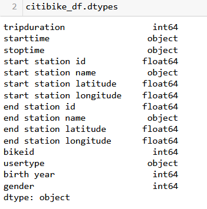
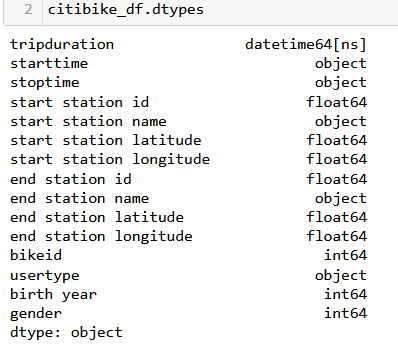

# NYC Bikesharing Analysis

# Background

Citi Bike is an affordable way to get around the town. It is very convenience for quick trips and that can save your time and money. 
There is a business proposal for investors in Des Moines for the bike sharing program. To solidify the proposal, one of the key stakeholders would like to see a bike trip analysis.

# Overview of the statistical analysis
The following analysis was conducted to demonstrate the potential of investing in a bike sharing business for the city of Des Moines. 
For this project, we have used data from the Citi Bike program in New York City. Data was contained in a csv file. The data from August 2019 was taken for the analysis because there is likely more traffic during the summer months.

Number of Trips, Trip Duration, Peak Hours, User Types, Number of trips by weekday for each hour, Checkout Time For Users, Checkout Time by Genders and many other factors were analysed.

(Deliverable 3)

## Deliverable 3:

The tableau story can be found in here ->  [NYC Bike Sharing Analysis Tableau Story](https://public.tableau.com/app/profile/shilpa8879/viz/NYCBikeSharingAnalysisAugustMonth/NYCBikeSharingAnalysisAugustMonth?publish=yes)

# Results
### Deliverable 1:

Converted "tripduration" column values from integer to a Datetime format.

Tripduration in Int64 datatype          |  Tripduration in datetime datatype
:--------------------------------------:|:-------------------------:
  |  

Citibike sharing data after converting datatype of tripduaration is as below,

### Deliverable 2:

1. The following visualization shows the pie graph with usertypes distribution among the total number of bike trips in August. This concludes that 81.07% of users for NYC Citibike are registered subscribers and only 18.93% are customers.

2. The data set analyzed in this project was taken from the month of August, 2019 NYC bikesharing. During the summer months, bike rentals tend to be at the highest since the weather is warm and is clearly reflected by the data and the bar chart above. In the month of August, the most popular times were from 8 AM to 10 AM and 3 PM to 8 PM.

3. The below line graph visualizations shows that the average trip duration/ how long bikes are checked out for all riders.

4. This visualisation shows that how long bikes are checked out for all riders and genders. It is useful to understand the trends and the needs of different users.

5. This visualization shows the number of bike trips by weekday for each hour of the day as a heatmap. We can easily infer that on all days from 7AM to 10AM and 4PM to 8PM are busy and on weekends, from 8AM to 8PM are busy.

6. This visualization shows the number of bike trips by gender for each hour of each day of the week as a heatmap. It helps to understand the effect of genders in bike trips. 

7. This visualization of heatmap shows the number of bike trips broken down by gender for each day of the week by each Usertype being subscribers or the customers. The heatmap shows, the user types, the "gender" and the "usage per day".

# Summary 

The NYC bike sharing data analysis provides lots of valuable insights to the new business proposal of setting up a bikesharing business in Des Moines, IOWA.
*  It is very clear that there is a high demand for bikes, regardless of gender and it appears to be a popular method of transportation for  the day-to-day needs. So it's not only tourists who use bikes. There are many people who use bikes for commuting back and forth to their workplaces. 

* We can see that more trips are taken by subscribers than other customers.

* Only bikes which are used a lot will require more maintainance. 

There are two other visualizations that can be made to analyse are, 
1. Top starting locations and it's bike station ID and name.
   Top ending locations for the trips and its station ID and name. The buisiness can put more bikes in most popular locations where people use more bikes.

2. User trips by Age: This data could help us decide the place where users would be more likely to use this service in Des Moines and to launch a station in that area. 

